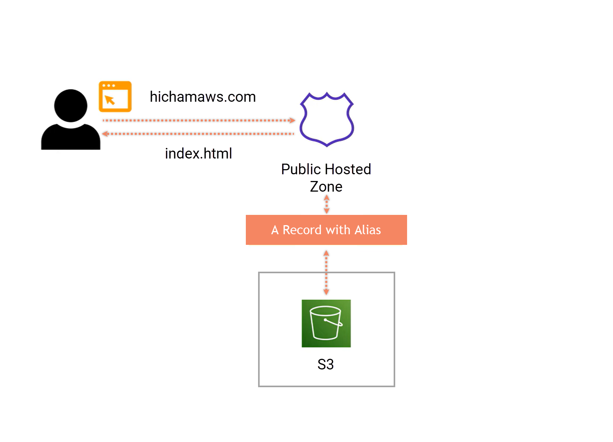

# Host a static resume on AWS

Simple resume hosted on AWS utilizing S3, CloudFront, Certificate Manager, and Route 53.

#
In this project, I've divided the tasks into three main parts:

## Part 1:
- Write HTML, CSS, and JavaScript code for my resume.
- Upload the files to a Simple Storage Service S3 bucket configured beforehand for static website hosting with public access.

## Part 2:
- Set up a custom domain using Route 53.
- Update DNS records to direct to the S3 website endpoint.

## Part 3:
- Set up aTLS/SSL certificate using AWS Certificate Manager (ACM).
- Establish a CloudFront distribution (that points to the files in S3).

#
#
AWS Services: S3 · Route 53 · CloudFront · ACM
